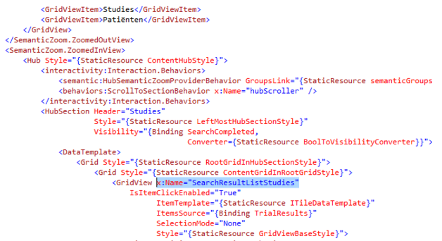

>These files contains the temporary representation of our thesis

# Testing Guideline

## Checklist: Testing

This is the checklist to review for every page. This means that for every page in the application, we need to test every paradigm documented in the checklist (control per control). If we find new paradigms while analyzing new pages, we will add these to the checklist and review all previously tested pages for the newly found paradigms.

This document contains the full checklist in which every paradigm that needs to be tested is fully explained together with how to test this paradigm. We also have an Excel document which contains the following sheets:


### General checklist
In this sheet, the general paradigms are displayed and we have indicate for every page if this paradigm is already tested or not. It looks like this:


### Paradigm checklist
In the Paradigm checklist, we have a more detailed list for the checklist, containing all the subcategories explained in this document. Here, we indicate wether a certain paradigm is already analysed on the “How to test?”-aspect. It looks like this:


### Example page & page checklists
In the example page, we have the same list as in the Paradigm checklist, but on top of it, but together with some of the basic controls which are present on every single page. On the Page checklists (one for each page), we use the example page and then search for every possible testable control. For every control we mapped, we indicate wether a certain paradigm needs to be tested on that control or not. The result looks like this: 


The first small column is a summary of each row, to indicate wether this paradigm is tested for all controls it needed to be tested for. 


### 1. Content
>This section contains every possible testscenario, which involves the data which is loaded in the application.

#### 1.1. Create

##### What?
Check if adding data (for example adding patient) and clicking the execute button adds the data you added to the database, do this by asserting the elements in the user interface where this data should be added after clicking the execute button.

##### How?
* Add all textfields (and if necessary, the “execute” button) involved in the “create”- action, to the UIMap.
* Clear all textfields with the “ClearEdit(textfield)” function from the BaseClassCodedUI.
* Add content to the textboxes by using the following line of Code:

```TextBox.Text = content;```

in which content is replaced by the data you want to add. To do this with external data: go to “How to test” → “Datadriven tests”.

* If necessary, click the execute button.
* Navigate to the page where your input should have influence and execute a “Read” test on the influenced controls, to make sure the data is added. How to execute a “Read” test is explained in the next paragraph. 


#### 1.2. Read
##### What?
###### Search algorithm

When using a searchbox, you want to check 3 things.

*A. Check all the possible parameters on wich you can perform a search (for example, search by name, search by trial, search by trialnumber,...).*

*B. Check if all the searchresults contain the parameter you searched.*

*C. Check if all possible searchresults available in the database, based on your search, are all displayed.*

###### Displayed data
Check if all controls on the page you are testing, containing data from the database, display the correct data for the parameters by which you got to that page. So for example, if you navigated to a trial with trial-id “4”. All controls in the TrialHub should contain the data of trial “4”, and not the data of for example trial “6” or completely faulty data. 

##### How?
###### General
If you want to make sure a certain word/value is displayed in every single ListItem in the list, you can use the ReadListItems-function:

```ReadListItems( list, expectedValue);```

This function loops over every ListItem and checks all datafields inside of it, if the ExpectedValue isn’t displayed in one of the ListItems, the test will fail. 

###### Search algorithm 

*A. to do*

*B. Use ReadListItems-function.*

*C. to do*

###### Displayed data

* Execute the correct actions to go to the page you are testing, using variables such as for example “Case ID”/”Trial ID”. Ideally, you should get this variable from a datafile in which all other data of this Case/Trial/… is available. For datadriven tests: go to “How to test” → “Datadriven tests”.
* Add the involved controls on the page to the UIMap. 
* To check if the data is correct, just assert to ```Control.Name``` or ```control.Text```, depending on the type of control involved. The expected value should be in your datafile, so to access this, check out datadriven tests.

#### 1.3. Update & delete

##### what?
This paradigm is similar to create, but now you change already existing data instead of creating new data. 

##### How?
The “how to” of Update/Delete is similar to the create. 
* Add all textfields (and if necessary, the “execute” button) involved in the “update”- action, to the UIMap.
* Clear all textfields with the “ClearEdit(textfield)” function from the BaseClassCodedUI.
* Add content to the textboxes by using the following line of Code:

```TextBox.Text = content;```

in which content is replaced by the data you want to add. To do this with external data: go to “How to test” → “Datadriven tests”.

* If necessary, click the execute button.
* Navigate to the page where your input should have influence and execute a “Read” test on the influenced controls, to make sure the data is updated. 
* How to execute a “Read” test is explained in the previous paragraph. 


#### 1.4 Custom
##### what?
* (things we may find in the future)

### 2. Navigations

#### 2.1 Correct navigation

##### what?

When navigating to a certain page, from the page you are testing, you have to make sure the application navigates to the correct page according to the navigation-control you used. To keep the testing project easily readable, we will concider each different tab of a page (if there are tabs available) as a different page. 

##### How?


###### Variable Controls

A variable Control is a Control which is embedded in a list, in which all cases of a certain object are displayed. For example, you can have a list of trials, patients, logs,... In other words, “variable” in this context means that there is never a fixed amount of Controls in the list, and the Controls displayed, never have a fixed instance inside the list. These kind of Controls all navigate to the same page, but the data displayed on that page is dependent on the instance you navigated to. 

To test the navigation of this kind of Control, use the following function:
```
NavigateVariableControl(parameters);
```

For more info about this function and its parameters, refer to “How to test” → “BaseClassCodedUI”


###### Fixed controls

A fixed Control is a Control which is embedded in a HubSection, in which every possible navigation-control has a fixed instance. Also, there is a fixed amount of navigation-control’s inside the hub. These kind of Controls normally navigate to a different page, or to a different state of the same page(for that, refer to the next paragraph). 

To test the navigation of this kind of Control, use one of the following functions: 

 * ```NavigateFixedControlToPage(parameters);```
 * ```NavigateFixedControlToTab(parameters);```

For more info about these function and there parameters, refer to “How to test” → “BaseClassCodedUI”.

###### Search navigation
//To finish


#### 2.2 Correct page state

##### What?

On some pages, you can use multible controls to navigate to the same page. But every control triggers a different page state on the page you navigated to. So you need a test which can assert if the navigation-control you used, triggers the correct page-state on the page navigated to. 

##### How?

//To finish


### 3. States

#### 3.1 Semantic zoom

##### What?

The semantic zoom is a control within a page, which contains a hub. This hub contains different hubsections, each with it’s own title. The semantic zoom is able to zoom out these hubsections so that they are displayed as a list of ListItems, each containing the text of one of the hubsection titles. This is a functionality that needs to be tested. 

* Zoomed in view:
//picture to be included
* Zoomed out view:
//picture to be included

##### How?


###### Zoom out/Zoom in

temporary for Zoom out & Zoom in:  BaseClassCodedUI function: 
```
AssertSemanticZoom(Hubsection, HubsectionSemanticName, action);
```
* Hubsection: Hubsection you want to test
* HubsectionSemanticName: Name of zoomed out listItem 
* representing hubsection
* action: CtrlKey/Scroll

###### Content

**What?**

Check if correct data is displayed in hubsections when zoomed out.
* Checkboxes

  On some pages, every element in the semantic zoom contains a checkbox, when zoomed out, the checkboxes on the zoomed out listItems have to be in the same state as the checkboxes on the zoomed in view. 

  example:


**How?**

* Checkboxes:

  1. Add both lists (zoomed in and zoomed out view) to the UIMap. Sometimes these lists do not contain a UID, so make sure to change the searchproperties afterwards. To make sure your testmethod always finds the correct list, add the correct instance to the list (in the above case, both lists have instance “2”).
  2. Add the semantic zoom to the UIMap
  3. Get al the elements of the list by using following function of the baseclassCodedUI:
```UITestControlCollection ZoomedInGroups = getHubSections(SemanticZoomList);```
  4. Make a bool-array to store the content of all checkboxes, give it the length of the UITestControlCollection you just created
  5. Store every checkboxes state in the array with a for function that loops over every element in your collection. The checkbox can be found by using the ```GetChildren()``` function ceveral times. To know which instance to use and how deep you have to search in the hierarchy of your collection, use the CodedUITestBuilder to see the place of the desired checkbox inside the hiërarchy. In the case above, the checkbox can be found by getting the second child of every element in the collection, and getting the first child of that child. To store the state of the checkbox, you have to use the ```.Checked``` property.
  6. Zoom out using the ```ZoomOutSemanticZoom(Action.CtrlScroll, SemanticZoom);``` function.
  7. Make a new UITestControlCollection for the zoomed out list using the same method as before.
  8. Assert the lengths of both collections (should be the same!)
  9. Assert the state of the zoomed out checkboxes is equals the bool-array you created earlier, with a for loop, that loops over every zoomed out ListItem. To find these checkboxes, use the same technique as described above (with ```GetChildren()```)
  10. Zoom in the semantic zoom using following function: ```ZoomInSemanticZoom(ZoomedOutListItems[0] as XamlControl, Action.CtrlScroll, SemanticZoom);```

###### Functionality
To check if the titles displayed in the zoomed out list of the hubsections, are the same as the titles in the zoomed in state (and the same amount), use the following function of the BaseClassCodedUI:
```
CheckSemanticZoomTitles();
```

#### 3.2 Overlay

##### 3.2.1 Content

###### CRUD

Look to: **1. Content**


##### 3.2.2 Navigations

Look to: **2. Navigations**

##### 3.2.3 Functionality
###### Speed
//NOT YET ANALYSED//
###### Control functionality

* Open overlay button

  ***What?***

  Check if using the button intended to open the overlay, triggers the overlay appearance.

  ***How?***

  1. Add button to the UIMap
  2. Add the full overlay to the UIMap as a control (this will be a Hub)
  3. Click the button
  4. Assert on the coördinates of the hub, if the hub is visible, these should have a value above “0”. Otherwise, all values should be “-1”. 

  *note: The overlay needs to be opened and used by your testmethod, before it can see the coördinates being set to -1 after closing it. If you don’t open it initially and try to search it’s coördinates, the testmethod will fail to find the overlay in the first place. *


* Close overlay button

  ***What?***

  Check if using the button intended to close the overlay, makes the overlay disappear.

  ***How?***
  1. Add “x” button to the UIMap (for some overlays, you may need to give an automationId to the button).
  ex. 

 ```
 <AppBarButton x:Name="CloseOverlayButton"
                Width="44"
                          Margin="0,0,0,0"
                          HorizontalAlignment="Left"
                          VerticalAlignment="Top"
                          HorizontalContentAlignment="Center"
                          Canvas.ZIndex="99"
                          Icon="Cancel"
                          IsEnabled="{Binding IsLoading,
                                              Converter={StaticResource InverseBooleanConverter}}">
                <interactivity:Interaction.Behaviors>
                    <core:EventTriggerBehavior EventName="Click">
                        <actions:OpenCloseOverlayAction Overlay="{Binding Overlay, Source={StaticResource overlayLink}}" State="Closed" />
                    </core:EventTriggerBehavior>
                </interactivity:Interaction.Behaviors>
            </AppBarButton>
 ```

   This button is located in the ClinicTrials.NewTrial - page, in which NewTrial is the overlay of ClinicTrials.
  
  2. Add the overlay hub to the UIMap
  3. Use the XamlControl.TryFind() function to make sure the overlay is opened.
  4. Click the button & add delay to make sure the overlay has time enough to close completely
  5. Check if one of the coördinates of the OverlayHub is still larger than zero, normally when a control is not visible on a page, it’s coördinates will all be set to “-1”.


* Close overlay with “esc”

  ***What?***

  Check if overlay closes when pressing the “esc”-key

  ***How?***
  Same method as above, but instead of clicking a button, use ```Keyboard.SendKeys(“{Escape}”)```


* Control functionality

  ***What?***

  Check if “execute” button is only enabled when correct datafields are filled in

  ***How?***
  
  1. Make sure the datafields involved are all empty before you begin checking the button’s state.
  2. Check button’s state after filling in datafields
  
  ex.

  ```
        public void ClinicTrialsPageOverlayCheckStudieToevoegenButtonState()
        {
            ClearEdit(StudieNummer);
            ClearEdit(ProtocolNummer);
            ClearEdit(Alias);
            if (ToevoegenButton.Enabled) Assert.Fail("Button is enabled when it should be disabled!");
            StudieNummer.Text = "Blabla";
            if (ToevoegenButton.Enabled) Assert.Fail("Button is enabled when it should be disabled!");
            ProtocolNummer.Text = "Blabla";
            if (ToevoegenButton.Enabled) Assert.Fail("Button is enabled when it should be disabled!");
            Alias.Text = "Blabla";
            if (!ToevoegenButton.Enabled) Assert.Fail("Button is disabled when it should be enabled!");
        }
```

#### 3.3 Filtering search

* Check if Combobox ordering function orders the page correctly

//NOT YET ANALYSED//

### 4. Functionality

#### 4.1 Speed

##### Reaction speed


###### What?

Check how fast a page is loaded when navigated to. Save this loading time and report. 

###### How?

1. Add the progressbar to the UIMap, to this by using the “Ctrl-i”-key combination while the page is loading, hovering over the progressbar. You will sometimes have to try this a few times because it disappears quickly.
2. In your code, navigate to the page and start a ```StopWatch``` (more info about the stopwatch in “how to test”)
3. Write a while function that keeps running as long as the progressbar’s coördinates are not below 0.
4. After the wile function, save the StopWatch.Elapsed property in a variable
5. Report the variable (still to analyse)


##### Reactivity

###### What?

Check if you can already use loaded functionality before the page is fully loaded. 

###### How?

//NOT YET ANALYSED//

#### 4.2 Scrolling

##### 4.2.1 Check “Mousewheel” scroll functionality	

###### What?

Check if the scroll function works with the “mousewheel”-action. 

###### How?

Use the following function of the BaseClassCodedUI:

```ScrollToControl(control,scrollControl, scrolldirection)```

* control: The control you want to scroll to
* scrollControl: The control you want to start scrolling from
* scrolldirection: Up or Down

##### 4.2.2 Check “scrollbar & drag” functionality

###### What?

Check if the scroll function works when clicking and holding the scrollbar and than dragging it across. 

###### How?

PROBLEM: Can not access the scrollbar in any way other than manual

##### 4.2.3 Check “Click scrollbar arrows” functionality

###### What?

Check if the scroll function works with when clicking the arrows of the scrollbar. 

###### How?

PROBLEM: Can not access the scrollbar-arrows in any way other than manual

##### 4.2.4 Check scrollbar state

###### What?

Check if hovering over the scrollbar makes the scrollbar highlight.

###### How?

PROBLEM: Can not access the scrollbar in any way other than manual

##### 4.2.5 Check scrollbar-arrows state

###### What?

Check if hovering over the scrollbar arrows makes the scrollbar arrows highlight

###### How?

PROBLEM: Can not access the scrollbar-arrows in any way other than manual

#### 4.3 Control state verification

##### 4.3.1 Initial

###### What?

Check if the control’s initial state (appearance) is as it should be.

###### How?

* color
* highlighted
* enabled
* default text
* default value
//To analyze//

##### 4.3.2 Hovered

###### What?

Check if the control’s state changes correctly when hovering over the control.

###### How?

* Mouse/cursor change
* color
* highlighted
* enabled
* default text
* default value

//To analyze//

##### 4.3.3 Clicked

###### What?

Check of the control’s state changes correctly when clicking on the control.

###### How?

* Mouse/cursor change
* color
* highlighted
* enabled
* default text
* default value

//To analyze//

##### 4.3.4 Click & hold

###### What?

Check if the control’s state changes correctly when clicking on it and holding your click.


###### How?

* Mouse/cursor change
* color
* highlighted
* enabled
* default text
* default value
* Control deepens?

//To analyze//

##### 4.3.5 Filled in

###### What?

Check if the control’s state changes correctly when filling it in.

###### How?

* color
* highlighted
* enabled
* value

//To analyze//

#### 4.4 Control accessibility 

##### What?

Check if the control is accessible through every action it should be accesible through. This means that the control will be selected when this action is executed.

##### How?

###### Click

1. Add the control to the UIMap
2. Click the control
3. Assert to the control’s “HasFocus” property (should be true)

###### Tab

1. Add the control to the UIMap
2. Tab to the control with the TabToControl function in the BaseClassCodedUI, in case the control you want to access is embedded in a list, use the ListItemEnter-function.
3. Assert to the control’s “HasFocus” property (should be true)

#### 4.5 Custom 
##### 4.5.1 Buttons

###### 4.5.1.1 General

A. Check if hovering over "Button" shows tooltip

B. Check if Button executes correct action when clicked

C. Check if Button executes correct action when hitting enter (if selected)

D. Check if Button executes correct action when hitting space (if selected)

###### 4.5.1.2 Toggle Button

A. Check if Toggle Button toggle-state is changed when clicked

B. Check if Toggle Button responds to ‘space’ key


##### 4.5.2 ListItems

A. Check if ListItem executes correct action when clicked

B. Check if ListItem executes correct action when hitting enter (if selected)

C. Check if ListItem executes correct action when hitting space (if selected)


##### 4.5.3 Edits

###### 4.5.3.1 General

A. Check clipboard functions with right mouse click:Cut

B. Check clipboard functions with right mouse click: Copy

C. Check clipboard functions with right mouse click: Paste

D. Check clipboard functions with right mouse click: Undo

E. Check clipboard functions with right mouse click: Select all

###### 4.5.3.2 TextBoxes

A. Verify correct data

B. Check if clicking the “x” in the Textbox sets it back into default state

C. Check the by default selected textbox

D.Check typing when selected --> text in selected textbox

###### 4.5.3.3 Searchbox

A. Check typing when selected --> text in searchbox

B. Check typing randomly --> text in searchbox

C. Check "esc" --> searchbox empty

D. Check the searchfunction for pressing “Enter”

E. Check the searchfunction for clicking the magnifying glass


##### 4.5.4 Combobox

A. Check if ComboBox responds to ‘arrow’ key: immediately change selected item

B. Check all selected item highlight functions

C. Check combobox scrolling functions

D. Select combobox Item: Check selected item is correct

E. Select combobox Item: check correct action following

F. Check if combobox opens with: Click

G. Check if combobox opens with: Enter (when selected)

H. Check if combobox opens with: Space (when selected)


## Testing: How to

In this section, we will describe how to write tests for every item on the checklist. This is the actual implementation of the tests. In here, we will also describe some guidelines in the test code to keep the code readable and easily adaptable.

### Basics

#### Coded UI Test Builder and UI Map

To add a Coded UI Test project:

* Right click on the map you want to add the project
* Select ‘Add’
* Select ‘New Item’

 

* Select ‘Test’
* Select ‘Coded UI Test (Windows Store apps)’

 

To add a UI map:

* Do the same steps as 'adding a Coded UI Test project'
* Select ‘Coded UI Test Map’ instead of ‘Coded UI Test (Windows Store apps)’

When you added a Coded UI Test project, the first thing you need to do is add the right UI Map as a variable in your test project.
At the top of your project, add a “using” statement for the UI Map you created. If I named my UI Map “UIMap_ClinicHubPage”, this is what I would have to add:

 `using Calidos.Maat.CodedUITests.Screens.Clinic.ClinicHub.UIMap_ClinicHubPageClasses;`

At the bottom of your project, change the UI Map property to something like this:
 
```public UIMap_ClinicHubPage UIMapClinicHub
{
  get
  {
    if (map == null)
    {
      map = new UIMap_ClinicHubPage();
    }
    return map;
  }
}
private UIMap_ClinicHubPage map;```
 
After doing this you can start writing tests. To write a test you first have to add the controls you want to use to the UI Map you created. To do this, right click on your ‘.uitest’ file and select “Edit with Coded UI Test Builder”.

The Coded UI Test Builder will launch itself. Dont worry if it minimizes your Visual Studio, the Builder just wants to indicate that you can start up your application you want to be mapping. By dragging the circular marker (‘Add Assertions’) onto the control you want to map you can add it to the UI Map. When you release the marker it will open another window, seen below. 

 

The control you selected will be higlighted within the application with a blue borded and on the right side of the new window you can see more detailed information about the currently selected control. If you click the arrow button in the top left hand corner you can see the hiërarchy in which the control is embedded as well.

> **Note:**
Because the Clinical Trials application ‘Maät’  is created as a Windows 10 Metro App, the Coded UI technology, mainly the Coded UI Test Builder, is not yet fully adapted for optimal hiërarchy detection. To properly recognize the correct hiërarchy, every control has to have a unique AutomationId. However, almost no control in the application has this Id. For example, to add ListItems we needed to figure out special techniques and workarounds in the test methods, which we will discuss later.

> To make sure control’s or lists are properly mapped and easy to find by the testprogram itself, we sometimes gave AutomationId’s to the control’s ourselves. To do this, open the XAML file of the page you want to test, and then search for an indication out of which you can derive this section is the section you want to give an AutomationId.

> Example: I gave a unique Id to a list, so I can later easily access the childs of that list

>  

> I wanted to give a unique Id to the list of Studies-searchresults, so I searched the XAML file for a while, tried naming some different grid’s and gridviews, untill I named the right one. Now if I select that list with the Coded UI Test Builder, the name I gave to it will appear as AutomationId, as seen below.

>  


##### Adding popup controls to the UIMap
Sometimes, we have to add control’s or menu’s to the UIMap that are only visible after clicking a certain button/control. If we just drag the croshair of the CodedUITestBuilder onto the screen, the popupmenu will disappear. A solution for this is using the “Ctrl-i”-combination while hovering over the menu, which will directly select the menu. 


#### Testmethods

##### Test Classes

When you create a Coded UI Test class, the class must be marked as being for testing purposes. This is done by Visual Studio itself by adding the “[CodedUITest]” tag in front of the namespace declaration. More sepcific, for the application we are working on at the moment, is the “[CodedUITest(CodedUITestType.WindowsStore)]” tag that was auto-generated for us.

######The ‘[TestMethod]’ tag

Every Coded UI Test needs to be preceded by a “[TestMethod]” tag, else the tests will not be picked up by Visual Studio’s test framework.
A basic testmethod skeleton is set up like this:

```
[TestMethod]
public void METHODNAME()
{
  //Implementation and assertion of TestMethod here
}
```

######The ‘[TestInitialize]’ tag

This method will be executed *before every* ‘[TestMethod]’. Its important to note the ‘every’ in bold. Whenever a testmethod is ran, The testing framework loops over the whole test project to check for initialization methods. This method wil always be ran first. Which could make it a usefull method at certain points.

In our project, we will use this tag to navigate to the desired page in the application before every TestMethod using Process() and a URI string that every page in the application posesses

######The ‘[TestCleanup]’ tag

This will be executed *after every* ‘[TestMethod]’. The same as with the TestInitialize, only after each and every testmethod. Usually this method contains a shutdown or close command to close the application after every test.

In our project this tag has not (yet) been used, bacause we dont want to reload all the data every few seconds for the UI tests.

######The ‘[DataSource()]’-tag

When you want to create a datadriven test (which is a test using external data for execution/assertion), this tag can be added on above the testmethod, together with the [TestMethod]-tag.

*Ex.*
`[DataSource("Microsoft.VisualStudio.TestTools.DataSource.CSV", @"C:\dev\CTO\Src\Dev\D.Peter.0\Client\Calidos.Maat\Calidos.Maat.CodedUITests\Screens\Clinic\ClinicTrailsPage\NieuweStudieToevoegenData.csv", "NieuweStudieToevoegenData#csv", DataAccessMethod.Sequential), TestMethod]`

Datasource uses 4 variables to connect to a datasource:

* Type of dataconnection (ex. CSV, XML,...)
* Path to datafile
* Table name
* Access method (sequential/random)

If you add a datatable to a testmethod, the method will be executed for every row in the table. 
The first row will be ignored and can be used to asign  variable names to your data for easy accesability. 

##### Testcontext

“TestContext”, which is a property declared at the bottom of each testproject, contains information about each test.

######Data

when the test contains a datasource, data can be read through TestContext. Do do this, you can use the property “TestContext.DataRow[row]” in which row can be an index number or a title of the row you gave in your datatable (in string format)

######TestName

In some testproject, you will want to be able to use different TestInitialize methods. However the TestInitialize tag can only be used once. To solve this problem, you can write private functions with the different initialization methods, and in the TestInitialize method you can write an if-statement using the TestContext.TestName property. This is a string representation of the name you gave to your testmethod.

*Ex.*
```
private void init(string searchWord)
{
  InitPlaybackSettings();
  
  _appStartUp.StartInfo.FileName = @"maat://Maat/Screens/Clinic/ClinicSearch?searchtext=" + searchWord;
  _appStartUp.Start();
 
  BackButton = new XamlControl(UIMapClinicSearch.UICalidosMaatWindowsWindow.UIItemBackButton);
}

private void initState1()
{
  init(Searchword1);
}

private void initState2()
{
  init(Searchword2);
}

private void initState3()
{
  init(Searchword3);
}

[TestInitialize]
public void Initialize()
{
  if (TestContext.TestName.Contains("State1"))
    initState1();
  else if (TestContext.TestName.Contains("State2"))
    initState2();
  else if (TestContext.TestName.Contains("State3"))
    initState3();
}
```

#### Generating controls

There are a few phases in order to generate a control in your testmethod:

* Identify the type of control you want to generate (XamlButton, XamlEdit,...).
  * XamlControl is a general name you can use for every type of Xaml control. The downside of doing so, is that you might not be able to use some control-specific properties. 
* After you identified the control, give it a unique, yet obvious name.
* Finally, assign a path to your control referring to the control you added to the UIMap.
* After generating a control, you can use its properties to create different kinds of tests. Some example of control properties often used in tests:
  * Name	The name of the control
  * Font	Textfont (handy when asserting if a tab is selected or not (Bold text)
  * Exists	Bool that indicates if the control exist on the current page or not
  * ...

Sometimes you want to use control-specific proporties (like for example with togglebuttons,...). Then you have to give a specific Xaml-type to the control (ex. XamlText, XamlEdit,...)

You will end up getting something like below image.

`XamlText homeText = UIMapClinicHub.UICalidosMaatWindowsWindow.UIHomeTitleText;`

#### Writing assertions

##### (Semi) Automatic asserts

The Coded UI Test Builder enables you to write semi-automatic asserts.

After selecting a control with the marker, you can make an assertion for a specific property, by selecting it and clicking “Add Assertion” in the top left corner of the window, or by simply right clicking on the property you wish to assert and choosing  “Add Assertion” as illustrated in the snapshot below.


A new window will pop up. Here you can choose the comparator, comparison value and message you will receive when the assertion fails. (Image below)


In the example we go for the ‘AreEqual’ comparator, but there are some more things you could choose from, like ‘Contains’ or ‘StartsWith’.

The comparison value is the value you want the actual value to be, in order to let the assertion pass. In other words, the test framework will get the actual value and check it against the comparison value.

Additionally you can add a Message on assertion failure to get a better understanding what went wrong if an assertion failed. When done, click the ‘OK’ button.

Click the “Generate” button at the Coded UI Test Builder and your assertion a name. You can also add a description to make sure everyone knows what the assertion is all about.

Your assertion is now ready. In order to use it, you have to call your UI Map first. Remember that everything that is generated with the Coded UI Test Builder is added to this map. After calling the UI Map you will see that your assertion is in the list of suggested code

`UIMapClinicSearch.AssertBackButtonNavigation();`

The UI Map in the example above, is the UI Map of the testproject, and the highlighted area is the name you gave to your assertion method. The assertion contains the expected value you assigned on creation. However, on certain moments we will want to have a different expected value. The value can still be changed within your testmethods or within the partial UI Map class (The part that doesnt contains auto-generated code). Changing the expected value can be done like below: 


##### Manual assertions

The advantage of manual asserts is that you have much more control over the control you want to assert to as well as the expected values to make the test as autonomous as possible.

A manual assertion always starts with the ‘Assert’ keyword followed by the comparator. Note that there are different comparators availbable when making a manual assertion (‘Contains’ for example is not available when using manual assertions). The comparator requires parameters to create the full assertion.

`Assert.AreEqual(true, hub.TryFind());`

In the example above , where we make an ‘AreEqual’ assertion, the first parameter is the expected value. The second parameter is the actual value. Where these 2 value’s come from, is completely under your control. This way of writing assertions is way more intensive then the auto-assertions, but makes room for some more flexibility. Manual assertions are written inside your testmethods.

#### BaseClassCodedUI

This is a baseclass we wrote ourselves, in which we write functions for actions we have to use very often. Like this, we can very easily perform the action multiple times in just one line of code. We will also add commonly used variables and global testscenario’s (that don’t require page-specific control’s but overal control’s, available on every page) to this class.

The BaseClassCodedUI is a partial class. Which means it is divided into multiple subclasses that alltogether make the full class.

The partial classes are named in a way it seemed most logical to us. We divided them into (currently) 5 partial classes:

* BaseClassCodedUI.cs
  * Contains methods that are a base for other methods within the 'baseclass'
* BaseClassCodedUI.Content.cs
  * Contains methods that involve content verification
* BaseClassCodedUI.Navigations.cs
  * Contains methods that involve navigations
* BaseClassCodedUI.States.cs
  * Contains methods that involve the handling of different states
* BaseClassCodedUI.Functionality.cs
  * Contains methods that involve interaction with controls

Every testproject that is created, has to inherit from this baseclass. 

###Adding Coded UI Tests to Build process

Some information considering this part can be found on below URL. This MSDN link has not yet been updated to Visual Studio 2015, but will generally be the same process to set up.

URL: https://msdn.microsoft.com/en-us/library/ms182465%28v=vs.110%29.aspx#Anchor_3
