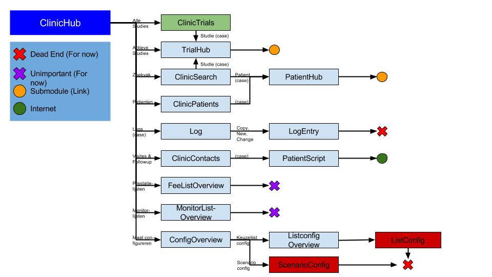

>Deze bestanden representeren een tijdelijke voorstelling van de scriptie 
### Hiërarchisch navigatie ontwerp

In de eerste fase van onze opdracht hebben we een hiërarchisch design opgesteld van alle navigatie die in de applicatie "Maät" mogelijk zijn. Dit hebben we gedaan door gewoon alle navigatie uit te proberen en te documenteren naar welke pagina, of eventueel welke sub-pagina, een knop leidt. Zo konden we niet alleen een handig overzicht creëren waarin we konden zien welke schermen het belangrijkste zijn en welke voorlopig minder belangrijk waren. Tegelijkertijd gaf dit het voordeel dat we leerden werken met de applicatie, wat handig werd bij het verdere verloop van het project. 

Het hiërarchisch design vertrekt vanuit de "ClinicHubPage". Dit is de hoofdpagina waarop we terecht komen als we de applicatie starten (Na het inloggen). Van hieruit is een boomstructuur getekend naar alle pagina's waarnaar navigatie mogelijk is vanuit de "ClinicHubPage" (Zie afbeelding onder voor voorbeeld). Vervolgens hebben we voor elke hub-pagina - pagina's van waaruit we naar meerdere andere pagina's kunnen navigeren - een nieuw bestand gemaakt waarin we dezelfde werkwijze volgden als bij de "ClinicHubPage", namelijk al deze pagina's laten vertakken uit de respectievelijke pagina. 

Op elke tak hebben we ook geschreven welke knop of handeling ervoor zorgt dat we op die specifieke pagina terecht komen. Ook hebben we per pagina de belangrijkheid aangeduid in het testgebeuren. Sommige pagina's zijn namelijk nog niet af, of zijn zelfs nog in hun beginfase. Dit zijn dan pagina's die in het totale testproject minder prioriteit hebben ten opzichte van de pagina's die wel al af zijn of belangrijke informatie bevatten.