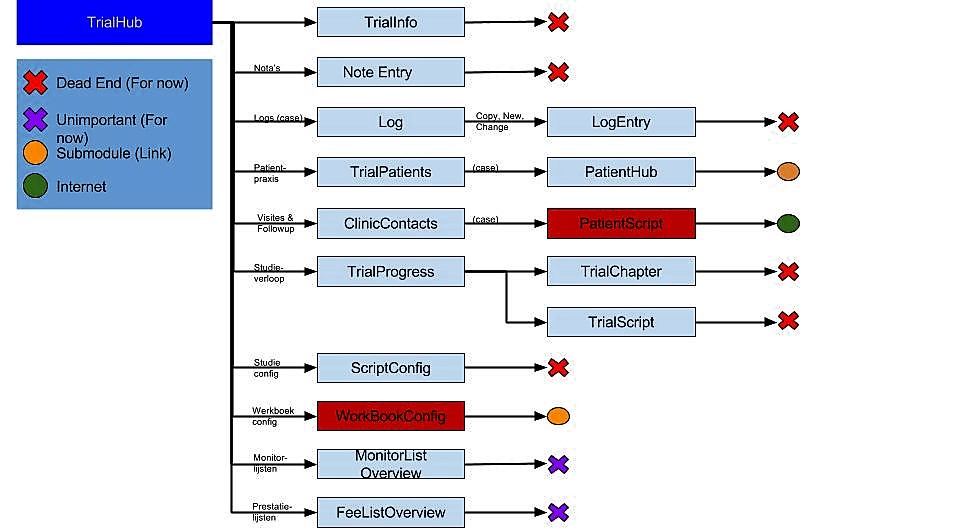
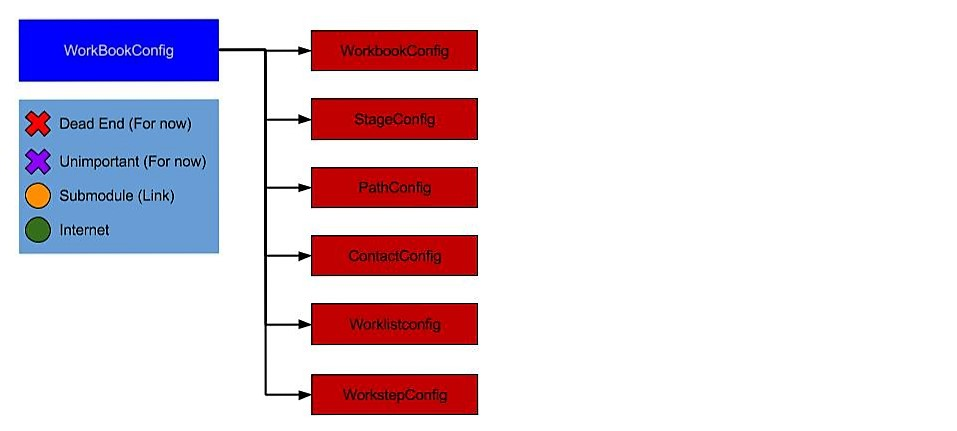

>These files contains the temporary representation of our thesis

# Methods and Techniques

## Testing: Basics

### Hierarchical navigation design

In this section, you can see a hierarchical design of all possible navigations inside the Clinical Trials application, ordered by page.

**ClinicHub**

**PatientHub**

**TrialHub**

**WorkBookConfig**

### Method Naming

To maintain the readability of the test project, here are some guidelines on how to name your testmethods

* Page name + Paradigm + Context + Xaml Name Property (+ optional info)
*  Ex: ClinicSearchNavigateStudieListItemState1()
* Page name: ClinicSearch
  * Page name indicates the page within which your test is situated
* Paradigm: Navigate
  * Paradigm is the kind of action you are testing for the control/set of controls (ex. navigate, zoom, toggle,...)
* Context: Studie
  * Indicator of the context in which the control/set of controls you want tot test exist, in this case, the method tests a “Studie-searchresult”
* XamlNameProperty: ListItem
  * In case of testing one specific control (or set of the same controls), this will indicate the kind of controls tested
* Optional info: State1
  * This will indicate extra info about the context of your test, in this case, the extra info indicates the stage of the page.

### File Structure

The Clinical Trials application follows a specific map structure for all it’s elements. To keep the file structure readable, we follow the same structure inside our testproject.

* Calidos.Maat.CodedUITests
  * Screens
    * General UI Map
    * Partial parent .cs files
    * '.csv' global scenarios
    * Category (clinic,…)
      * '.csv' categorical scenarios
      * Page (contactspage,….)
        * UI Map
        * '.csv' local scenarios
        * '.cs' files per category
          * States
            * All tests regarding the different states of a page
          * Navigation
            * All tests regarding forward navigations from a page and backwards navigation to the page
          * Functionality
            * All tests regarding functionality/interfunctionality of controls
          * Content	
            * All tests regarding data in the database