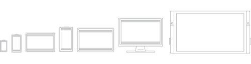
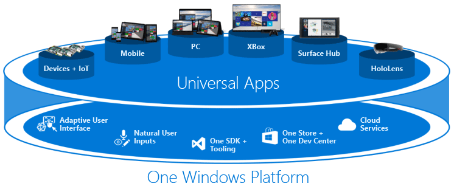

# Outlines

## Windows 10 Metro Applications

To get a better view and idea on what we are doing with our project, we will take a closer look into the platform that we are using. The Windows 10 Metro App make it easy to build a single project that runs on all supported platforms, which will include Windows 10 PCs, tablets, phones, Xbox One and Windows 10 IoT (Internet of Things).

 
Previously, a Universal App included multiple projects, one for shared code, and another for each supported platform, and you would build separate apps per platform. In order to achieve this level of compatibility, Microsoft has factored out a “Windows Core” which is common to all platforms.

### UWP

Designing an app that looks good on such a wide variety of devices can be a big challenge. So how do you go about designing an app that provides a great UX on devices with dramatically different screen sizes and input methods? Fortunately, the Universal Windows Platform (UWP) provides a set of built-in features and universal building blocks that help you do just that.

#### UWP app features

* Effective pixels and scaling
  * UWP apps automatically adjust the size of controls, fonts, and other UI elements so that they are legible on all devices.
* Universal input and smart interactions
* Universal controls
  * The UWP provides a set of universal controls that are guaranteed to work well on all Windows-powered devices. This set of universal controls includes everything from common form controls like radio button and text box to sophisticated controls like grid view and list view that can generate lists of items from a stream of data and a template. These controls are input-aware and deploy with the proper set of input affordances, event states, and overall functionality for each device family.
* Universal styles
  * Your UWP app automatically gets a default set of styles that gives you a bunch of different features

#### Responsive design techniques

* Reposition
  * You can alter the location and position of app UI elements to get the most out of each device. In this example, the portrait view on phone or phablet necessitates a scrolling UI because only one full frame is visible at a time. When the app translates to a device that allows two full on-screen frames, whether in portrait or landscape orientation, frame B can occupy a dedicated space. If you're using a grid for positioning, you can stick to the same grid when UI elements are repositioned.

* Resize
  * You can optimize the frame size by adjusting the margins and size of UI elements. This could allow you to augment the reading experience on a larger screen by simply growing the content frame.

* Reflow
  * By changing the flow of UI elements based on device and orientation, your app can offer an optimal display of content. For instance, when going to a larger screen, it might make sense to switch larger containers, add columns, and generate list items in a different way.

* Reveal
  * You can reveal UI based on screen real estate, or when the device supports additional functionality, specific situations, or preferred screen orientations.

* Replace
  * This technique lets you switch the user interface for a specific device size-class or orientation. In this example, the nav pane and its compact, transient UI works well for a smaller device, but on a larger device tabs might be a better choice.

* Re-architect
  * You can collapse or fork the architecture of your app to better target specific devices. In this example, going from the left device to the right device demonstrates the joining of pages.

